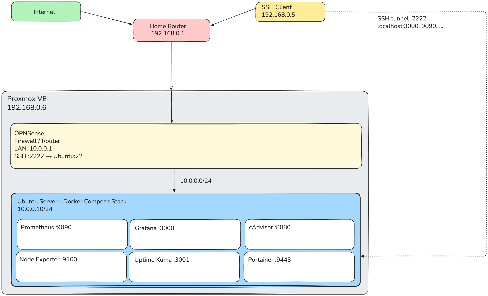
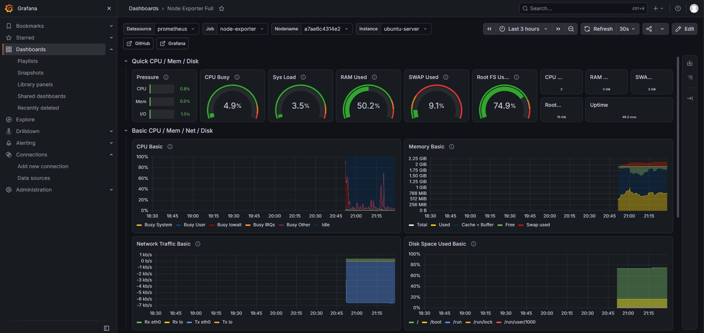
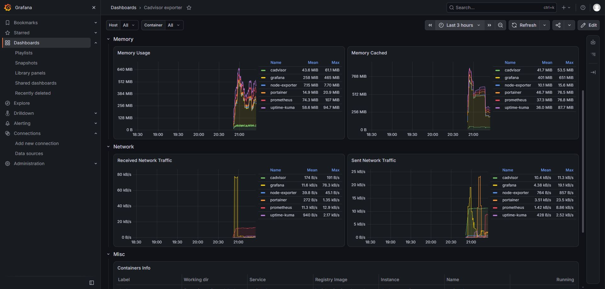
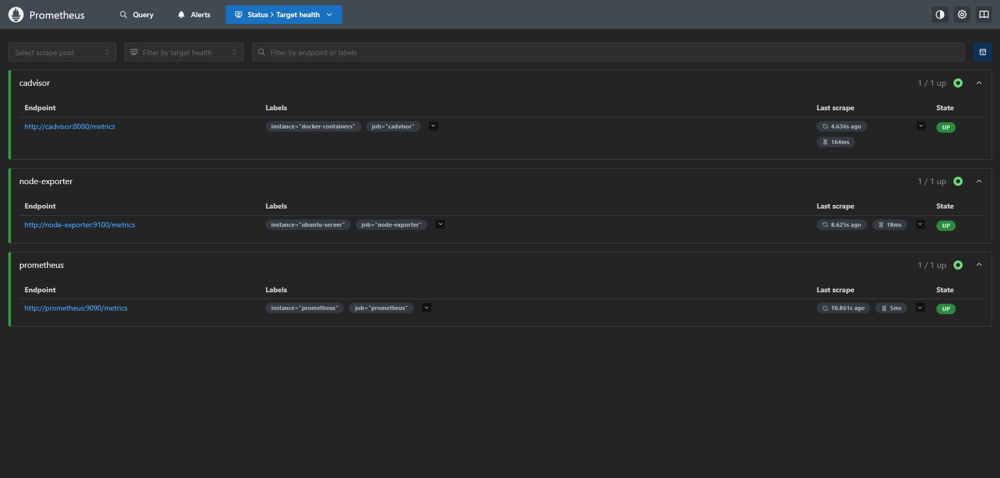
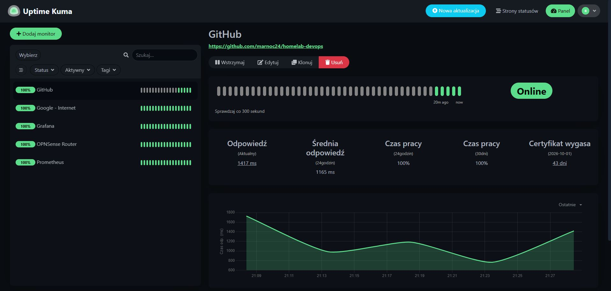
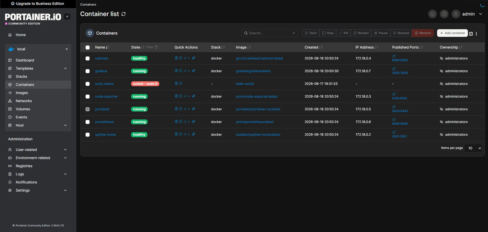

# homelab-devops

> **Home Laboratory Infrastructure** demonstrating **Infrastructure as Code**, **Containerization**, **Monitoring**, and **Cloud Integration**.
> Built as a portfolio project for IT Internship applications and preparation for **Microsoft AZ-900** certification.

---

## 🎯 Project Goals
- **Infrastructure as Code (IaC):** Automated infrastructure setup using Ansible and Terraform.
- **Monitoring & Observability:** Production-grade monitoring stack with Prometheus, Grafana, cAdvisor, and Uptime Kuma.
- **Cloud Integration:** Deploy and manage cloud resources on Microsoft Azure using Terraform.
- **Security-First Approach:** Segmented network topology, SSH tunneling, and zero direct public exposure.
- **Portfolio Standard:** Clean, reproducible, and well-documented codebase.

---

## 🏗️ Architecture



---

## 🛠️ Tech Stack

| Category | Technology | Purpose |
|---|---|---|
| **Hypervisor** | Proxmox VE 8.x | Virtualization platform |
| **Firewall / Router** | OPNsense | Network security, routing, NAT |
| **Target OS** | Ubuntu Server 22.04 LTS | Base OS for VMs |
| **Automation** | Ansible | Configuration management (IaC) |
| **Cloud Provisioning** | Terraform | Cloud infrastructure provisioning |
| **Cloud Provider** | Microsoft Azure | Cloud platform (VM, VNet, NSG) |
| **Containerization** | Docker & Docker Compose | Application containerization |
| **Metrics Collector** | Prometheus | Time-series metrics collection |
| **Visualization** | Grafana | System & container dashboards |
| **Container Metrics** | cAdvisor | Resource usage metrics per container |
| **Host Metrics** | Node Exporter | Hardware & OS metrics collector |
| **Uptime Monitoring** | Uptime Kuma | Service availability monitoring |
| **Container UI** | Portainer | Container management interface |
| **VCS** | Git & GitHub | Version control |

---

## 📁 Repository Structure

```text
homelab-devops/
├── .github/workflows/         # CI/CD pipelines
├── ansible/
│   ├── inventory/
│   │   └── hosts.yml          # Server inventory
│   └── playbooks/
│       ├── base-setup.yml     # Base OS configuration
│       └── docker-install.yml # Docker CE installation
├── docker/
│   ├── docker-compose.yml     # Monitoring stack definition
│   └── .env.example           # Environment variables template
├── monitoring/
│   └── prometheus/
│       └── prometheus.yml     # Prometheus scrape configuration
├── terraform/
│   └── azure/
│       ├── main.tf            # Azure resources (RG, VNet, NSG, VM)
│       ├── variables.tf       # Parameterized configuration
│       ├── outputs.tf         # Public IP and SSH command outputs
│       ├── cloud-init.yml     # Nginx provisioning on boot
│       └── terraform.tfvars.example
├── docs/
│   ├── diagrams/              # Architecture diagrams
│   ├── screenshots/           # UI screenshots
│   └── access-guide.md        # SSH Tunneling instructions
├── scripts/                   # Utility scripts
├── opnsense/                  # Firewall documentation
├── .gitignore
├── LICENSE
└── README.md
```

---

## ✨ Features

### ✅ Implemented
- **Proxmox VE Virtualization:** Isolated lab environment on physical host.
- **Network Segmentation:** OPNsense firewall with custom LAN/WAN rules.
- **Automated Base Setup via Ansible:**
  - System updating and essential package installation.
  - UFW firewall configuration with strict defaults.
  - Fail2ban protection against brute-force attacks.
  - Custom MOTD and timezone alignment (`Europe/Warsaw`).
- **Automated Docker Stack Deployment:**
  - Official Docker CE + Docker Compose plugin via Ansible.
  - 6-container monitoring stack (`Prometheus`, `Grafana`, `Node Exporter`, `cAdvisor`, `Uptime Kuma`, `Portainer`).
  - Pre-configured Grafana dashboards for Host and Container metrics.
- **Cloud Infrastructure via Terraform:**
  - Fully automated Microsoft Azure deployment (Resource Group, VNet, Subnet, NSG, Public IP, Ubuntu Linux VM).
  - Cloud-init integration for automatic Nginx web server installation.
  - Full lifecycle management (`init` -> `plan` -> `apply` -> `destroy`).

---

## 🚀 Quick Start

### Prerequisites
- Proxmox VE host or local Ubuntu VM.
- Ansible 2.15+ installed on control node.
- Terraform 1.5+ and Azure CLI installed for cloud deployment.

### 1. Clone the Repository
```bash
git clone https://github.com/marnoc24/homelab-devops.git
cd homelab-devops
```

### 2. Configure Ansible Inventory
Edit `ansible/inventory/hosts.yml` with your server IP and SSH user credentials.

### 3. Run Base Setup Playbook
```bash
ansible-playbook -i ansible/inventory/hosts.yml ansible/playbooks/base-setup.yml
```

### 4. Install Docker
```bash
ansible-playbook -i ansible/inventory/hosts.yml ansible/playbooks/docker-install.yml
```

### 5. Deploy Monitoring Stack
```bash
cd docker
cp .env.example .env
docker compose up -d
```

---

## ☁️ Cloud Infrastructure (Terraform & Azure)

Declarative IaC module to provision a temporary, cost-controlled environment in Microsoft Azure.

### Deployed Resources
| Resource | Details |
|---|---|
| **Resource Group** | Logical container in `polandcentral` |
| **Virtual Network** | `10.1.0.0/16` with Subnet `10.1.1.0/24` |
| **Network Security Group** | Inbound rules for SSH (22) and HTTP (80) |
| **Public IP** | Static allocation, Standard SKU |
| **Linux VM** | Ubuntu 22.04 LTS (`Standard_B1s` - Free Tier) |
| **Cloud-Init** | Automatic Nginx installation on first boot |

### Deploy
```bash
cd terraform/azure
cp terraform.tfvars.example terraform.tfvars
# Fill in your Azure Subscription ID in terraform.tfvars

terraform init
terraform plan
terraform apply
```

### Destroy (Cost Control)
```bash
terraform destroy
```

---

## 🔒 Service Access & Security

Services are not publicly exposed to the Internet. Access is secured using SSH Tunneling via OPNsense.

### Create SSH Tunnel
```bash
ssh -p 2222 \
  -L 3000:10.0.0.10:3000 \
  -L 9090:10.0.0.10:9090 \
  -L 3001:10.0.0.10:3001 \
  -L 9443:10.0.0.10:9443 \
  -L 8080:10.0.0.10:8080 \
  -L 9100:10.0.0.10:9100 \
  emes@<your-opnsense-ip>
```

### Service URLs (via Tunnel)
| Service | URL | Purpose |
|---|---|---|
| **Grafana** | `http://localhost:3000` | Metrics visualization |
| **Prometheus** | `http://localhost:9090` | Time-series query engine |
| **Uptime Kuma** | `http://localhost:3001` | Status monitoring |
| **Portainer** | `https://localhost:9443` | Container management |
| **cAdvisor** | `http://localhost:8080` | Container resource metrics |
| **Node Exporter** | `http://localhost:9100` | Host metrics endpoint |

---

## 📸 Screenshots

### System Metrics Dashboard (Grafana - Node Exporter Full)


### Container Metrics Dashboard (Grafana - cAdvisor)


### Prometheus Scrape Targets


### Uptime Monitoring (Uptime Kuma)


### Container Management Interface (Portainer)


---

## 🧠 Learning Outcomes & DevOps Practices

- **Infrastructure as Code (IaC):** Modular Ansible playbooks and Terraform code for full system lifecycle management.
- **Cloud Administration (Azure):** VNet design, NSG security rules, Public IP management, and cloud-init auto-provisioning.
- **Containerization & Orchestration:** Multi-container environments managed via Docker Compose with volume persistence and custom network bridges.
- **Observability:** Metrics scraping architecture, target configuration, and dashboard management in Grafana.
- **Linux Security:** User management, sudoers configuration, UFW rules, Fail2ban integration, and key-based SSH authentication.

---

## 📜 Certifications & Learning Path
- ⏳ **In Progress:** Microsoft AZ-900 (Azure Fundamentals) — Target: September 2026
- 🎯 **Next Steps:** Microsoft AZ-104 (Azure Administrator) & HashiCorp Certified: Terraform Associate

---

## 📄 License
Distributed under the MIT License. See `LICENSE` for more information.

---

## 👤 Author
**Marcin Nocuń**
- GitHub: [@marnoc24](https://github.com/marnoc24)
